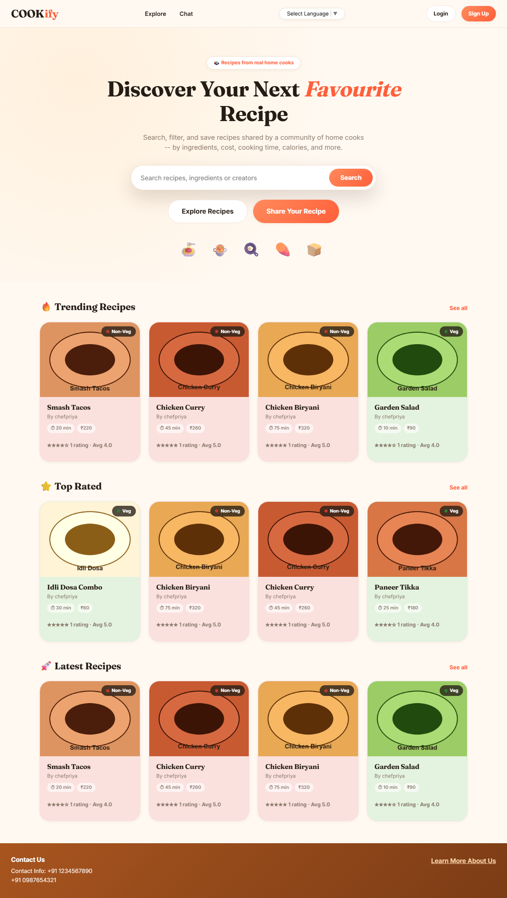
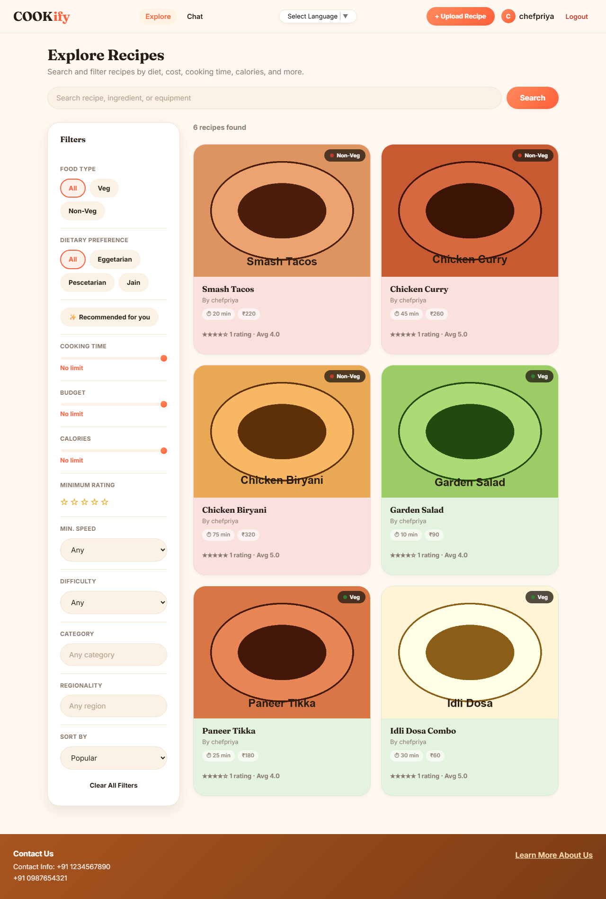
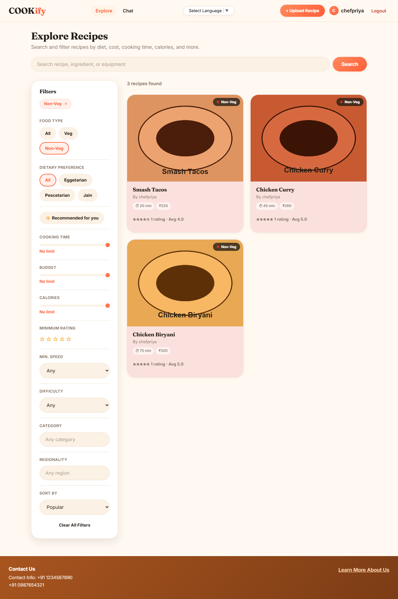
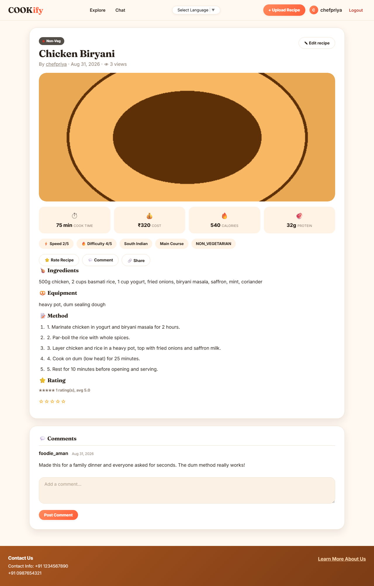
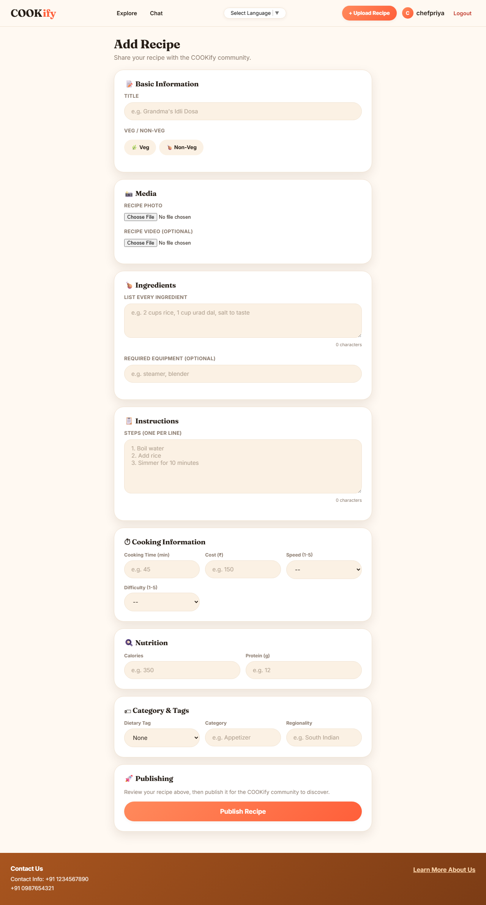
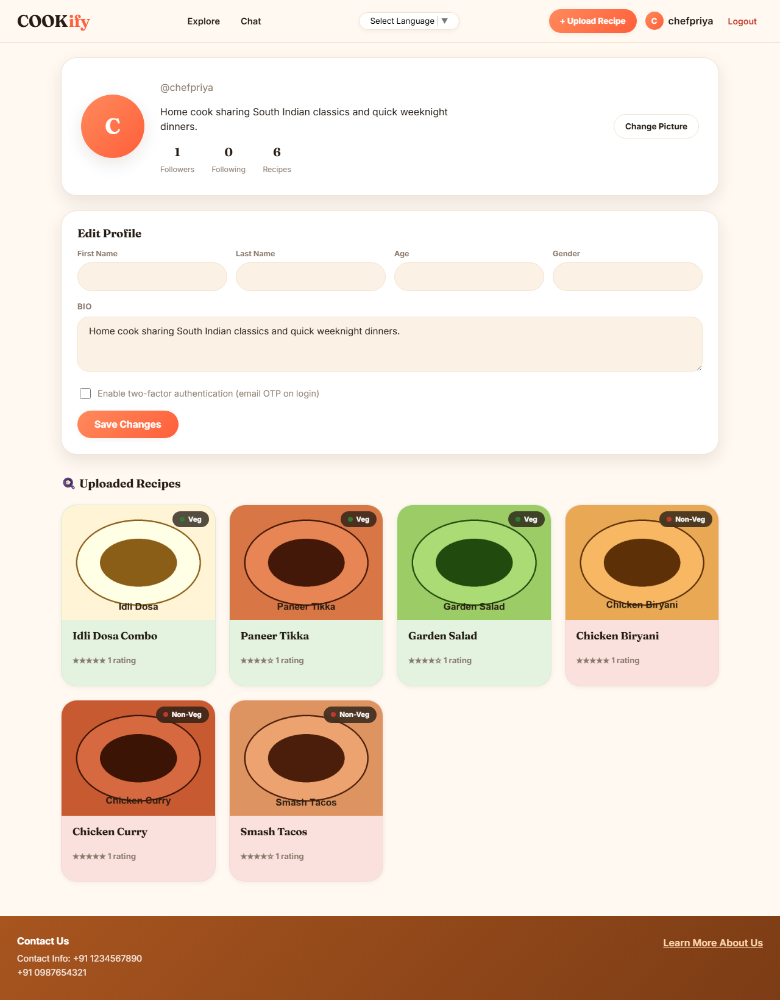
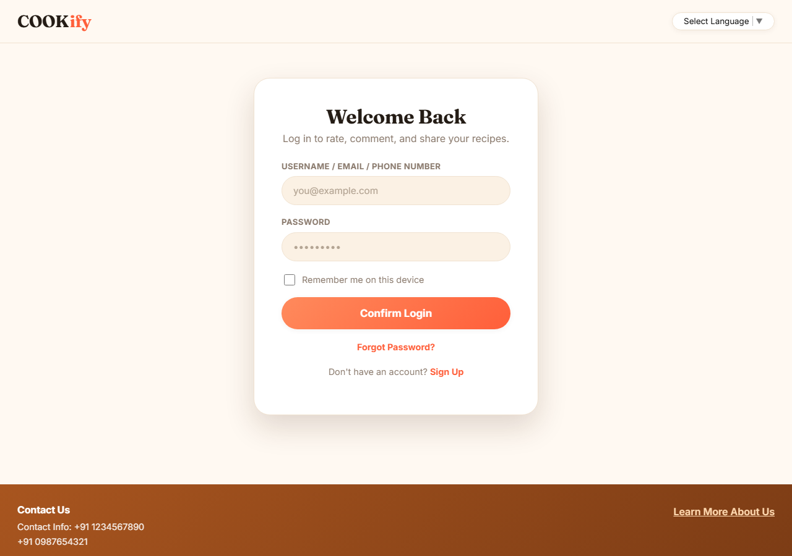
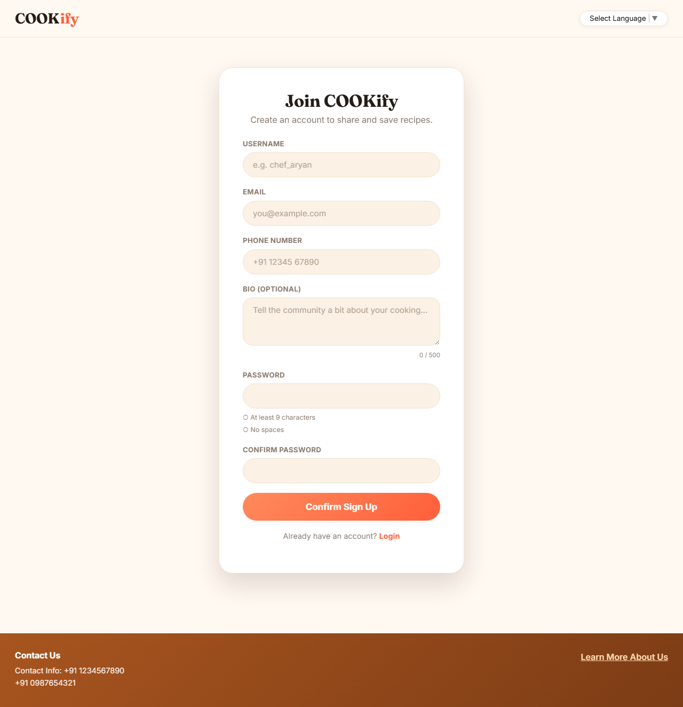
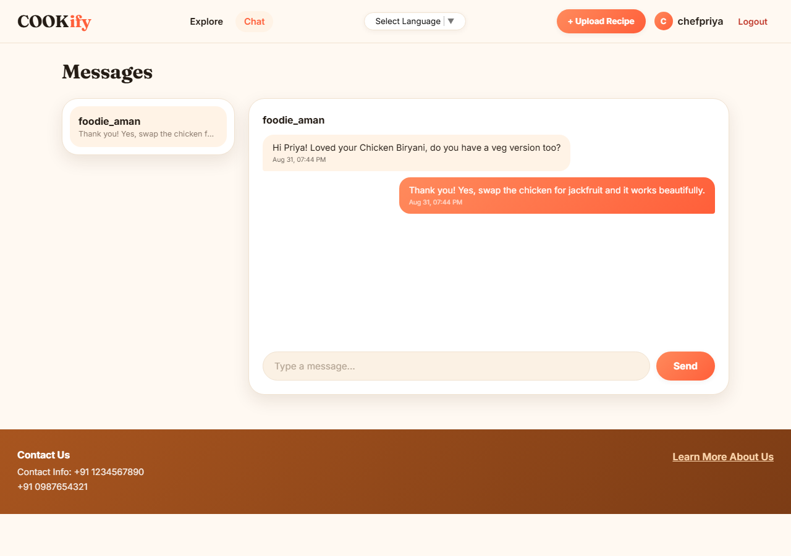

# COOKify

A recipe-sharing web application: sign up, upload recipes with photo/video, search and filter by ingredients, cost, cooking time, calories, veg/non-veg and more, rate and comment on recipes, subscribe to other creators, and chat — built as described in `Interview technical assigment.pdf`.

**Backend:** Java 17, Spring Boot 4.1.1, Spring Security 7 (session + CSRF + BCrypt), Spring Data JPA (Hibernate), H2 (file-mode database).
**Frontend:** static HTML/CSS/JS, no build step, no framework.
**Build:** Maven.

## Screenshots

| Home | Explore | Explore (filtered) |
|---|---|---|
|  |  |  |

| Recipe detail | Add Recipe | Profile |
|---|---|---|
|  |  |  |

| Login | Sign Up | Chat |
|---|---|---|
|  |  |  |

## Running it locally

Prerequisites: JDK 17+ and Maven on `PATH` (or use the bundled `./mvnw` / `mvnw.cmd` wrapper).

```
mvn spring-boot:run
```

Then open **http://localhost:8080**. The app creates its H2 database under `./data/` and uploaded files under `./uploads/` on first run (both are gitignored).

**Email**: no SMTP account is configured, so outgoing email (2FA codes, password resets, notifications) is logged to the console instead of sent — search the console output for `[MAIL:LOG-MODE]` to find a code. Set `app.mail.mode=smtp` and the `spring.mail.*` properties in `application.properties` to send real email.

**H2 console** (inspect the database directly): http://localhost:8080/h2-console, JDBC URL `jdbc:h2:file:./data/cookifydb`, user `sa`, empty password.

## Project structure

```
src/main/java/com/cookify/
  model/            JPA entities (User, Recipe + VegRecipe/NonVegRecipe, Rating, Comment, Subscription, Warning, ChatMessage, ...)
  repository/       Spring Data repositories
  service/          Business logic (auth, recipes, search, moderation, subscriptions, chat, ...)
  controller/       REST endpoints
  dto/              Request/response records
  security/         Spring Security integration (UserDetails, entry points, remember-me)
  config/           Security, Jackson, and static-resource configuration
  exception/        Centralized error handling
src/main/resources/
  static/           The frontend (HTML/CSS/JS, served directly by Spring Boot)
  application.properties
```

## What's implemented

- **Accounts**: sign-up, login (username/email/phone), optional email-based two-factor authentication, "remember me" persistent sessions, email-token password reset, profile editing, profile picture upload.
- **Recipes**: create/edit with image and video, categories/tags (cuisine region, food type, dietary tag, required equipment), speed/difficulty/cost, view counts. Diet (Veg/Non-Veg) is modeled as a real Java class hierarchy (`Recipe` → `VegRecipe`/`NonVegRecipe`) with polymorphic behavior, per the assignment's OOP requirement.
- **Search & filters**: keyword search (name/ingredients/equipment), veg/non-veg, dietary tag, cooking time, calories, cost, speed, difficulty, cuisine region, food type, minimum rating, and three sort modes — plus a "recommended for you" boost for recipes from creators you follow.
- **Ratings**: 1–5 stars, averaged, re-rating updates your existing score.
- **Comments**: posted per recipe, with NSFW keyword filtering — blocked comments are never stored, but the poster is warned.
- **Moderation & ban**: warnings accumulate and email the user; the 3rd warning bans the account and cascades deletion of that user's recipes, comments, ratings, saved recipes, subscriptions, and chat messages (their own and others' on their now-deleted recipes).
- **Subscriptions**: subscribe/unsubscribe, follower/following counts, email when you gain a subscriber, email when someone you follow uploads a new recipe.
- **Chat**: 1-to-1 messaging between users, reachable from a profile page.
- **Multilingual**: Google Translate's website widget on every page (Hindi, Mandarin, Russian, Spanish, French).

Every place the implementation had to resolve an ambiguity, fill a gap, or choose between conflicting parts of the assignment's source material is documented — with the reasoning — in **[DESIGN-DEVIATIONS.md](DESIGN-DEVIATIONS.md)**.

## Test table walkthrough

The assignment's PDF specifies 13 test cases. Here's how each was verified during development (not just implemented — see the commit history and `DESIGN-DEVIATIONS.md` for the specifics of what broke and got fixed along the way).

| # | Case | How it was verified |
|---|------|----------------------|
| 1 | Account Creation | Signed up with username, password, email, bio, and profile picture (uploaded via the profile page after signup); confirmed all fields persisted. |
| 2 | Login | Logged in with correct credentials; tested with and without 2FA (email OTP, wrong-code rejection); confirmed "remember me" issues a persistent cookie that survives a server restart. |
| 3 | Recipe Storage | Uploaded recipes with text, image, and video, with filters set (speed, difficulty, veg/non-veg, cost, etc.); confirmed the recipe is retrievable and its media is served back over HTTP. |
| 4 | Search by Filters | Searched/filtered by speed, difficulty, cooking time, cuisine region ("South Indian", "pan-Asian", "English"), and food type ("Breakfast", "Appetizer", "Main Course"); confirmed only matching recipes are returned for each filter individually and in combination. |
| 5 | Veg/Non-Veg toggle | Filtered by `dietType=VEG`/`NON_VEG` (backed by the `VegRecipe`/`NonVegRecipe` class hierarchy) and by the finer `dietaryTag` (vegan, eggetarian, pescetarian, jain, etc.). |
| 6 | Popularity Sorting | Confirmed the default sort orders by views then upload date, and that view counts increment on each recipe view (and, after a bug fix, *only* on an actual view — not as a side effect of rating). |
| 7 | UX and Website Aesthetics | Consistent COOKify palette (cream ground, coral/orange actions, terracotta footer, pale pink/green diet tints) and layout across all 9 screens, verified visually via real-browser screenshots. |
| 8 | Commenting | Posted a comment and confirmed it's stored and appears under the recipe; posted NSFW comments and confirmed they're blocked (never stored), the poster is emailed a warning, and the warning is recorded against their account. |
| 9 | Rating System | Rated a recipe out of 5 stars; rated it again and confirmed the average updates rather than duplicating; confirmed the total rating count is correct. |
| 10 | Code Modularity | Layered architecture (entity/repository/service/controller/DTO), one responsibility per service, consistent naming traceable back to the assignment's own pseudocode function names (`isUserIDUnique`, `validatePassword`, `validateComment`, etc.). |
| 11 | Ban Feature | Triggered 3 warnings on a test account (via repeated NSFW comments) and confirmed the account is banned, login is rejected afterward, and the account's recipes/comments/ratings/subscriptions/chat messages are removed — including content on their own recipes left by *other* users. |
| 12 | Multilingual | Confirmed the Google Translate widget renders on every page and offers Hindi, Mandarin, Russian, Spanish, and French. |
| 13 | Subscription | Subscribed one test account to another; confirmed the follower count updates, the creator is emailed, and recipes from a followed creator are boosted to the top of that subscriber's "recommended" results. |

## Known limitations

- **Chat** is intentionally a thin slice (polling every 4 seconds, no WebSocket, no NSFW filtering) — the assignment gives it no design artifacts of any kind to build against.
- **NSFW filtering** is a small representative keyword blocklist, not a real moderation model — none is specified anywhere in the source material.
- **"Saved Recipes"** (shown on the Profile Page prototype) has a database entity but no save/unsave endpoint yet.
- **Email** defaults to console logging since no SMTP account has been provisioned.
